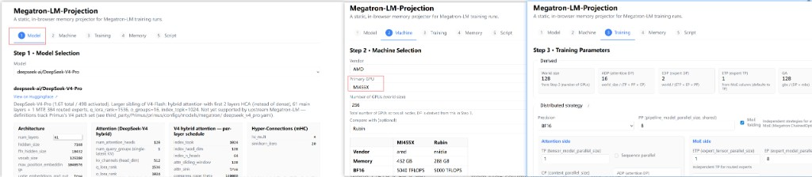

# Megatron-LM-Projection

A static, in-browser memory **projector** for Megatron-LM training runs. Pick a
model, pick the GPUs, dial in the distributed strategy, and immediately see —
per rank, per layer, per memory category — whether a configuration will fit
before you ever spin up a cluster.

**Try it now → [wenxie-amd.github.io/Megatron-LM-Projection](https://wenxie-amd.github.io/Megatron-LM-Projection/)**

No backend, no install. The whole projection runs client-side via
[Pyodide](https://pyodide.org/) loading a Python wheel built from this repo, so
your config never leaves the browser.



## What it does

The web app is a 5-step wizard:

1. **Model** — pick from 17 production model presets (Llama-3.1 8B/70B/405B,
   Mixtral, Qwen3, DeepSeek-V2/V3/V4-Flash/V4-Pro, Kimi-K2, GPT-OSS, GLM-5)
   or override `num_layers` to project a proxy model. The breakdown card
   surfaces per-module parameter counts, FFN/MoE internals, and the V4 hybrid
   attention schedule by `compress_ratio`.
2. **Machine** — pick a primary GPU (and optionally a secondary one for
   heterogeneous specs) from 11 datacenter GPUs spanning H100/H200,
   B200/GB200/GB300, Rubin, and MI300X/325X/350X/355X/455X. Sets the world
   size.
3. **Training** — set precision, distributed strategy (TP/PP/CP/EP/VPP, with
   optional MoE folding and chained optimizers), recompute, batch size,
   sequence length. DP / EDP / GA are *derived* from world size and shown
   live; configuration violations surface as inline banners.
4. **Memory** — per-rank stacked bar chart of params / activations /
   gradient buffer / optimizer main param / optimizer state, against the
   chosen GPU's memory roofline. Tooltip shows per-category breakdown plus
   total memory at that rank. Includes a detailed per-rank breakdown table.
5. **Script** — generates a Megatron-LM `torchrun` launch script with the
   resolved arguments. For DeepSeek-V4 the script also includes V4-specific
   flags (compress-ratios, hc-mult, attn-sink, index-topk, mtp-num-layers,
   …) as a blueprint — V4 is not yet supported in upstream Megatron-LM.

## What's modeled

The Python core mirrors the relevant slice of Megatron's `TransformerConfig`
and re-implements its memory formulas from scratch, then pins them against
real `megatron.core` in `projection/tests/fixtures/` as a gold standard.

- Parameters: embedding, attention (MHA / GQA / **MLA** / **DeepSeek-V4
  hybrid**), MLP, MoE (routed + shared experts + router, with optional MoE
  folding), normalization, output projection, MTP layers.
- Activations: per Korthikanti et al., with all four
  `{sequence_parallel} × {selective recompute}` cells separately modeled,
  plus full / partial-full recompute, PP / VPP unequal-rank penalties, and
  embedding / output overhead on the first / last PP rank. For DeepSeek-V4
  the per-layer activation is scaled by `hc_mult` (mHC streams pack into the
  sequence axis).
- Optimizer state: Adam with precision-aware dtypes (`main_param`,
  `main_grad`, `exp_avg`, `exp_avg_sq` each independently configurable),
  distributed optimizer sharding, single FP32 gradient buffer. FSDP-2 and
  Megatron-FSDP are also modeled.
- Rank decomposition: follows Megatron's `RankGenerator` for both the default
  and expert groups, so `EDP` can legitimately come out fractional (`1/n`)
  when EP > attention DP.

## DeepSeek-V4 support

V4-Flash (284B) and V4-Pro (1.6T) are first-class projection targets. Because
V4 is not yet in upstream Megatron-LM, the implementation tracks the Primus
patch set under `third_party/Primus/`:

- **Hybrid attention** — per-layer `compress_ratio ∈ {0, 4, 128}`
  - cr=0: dense + sliding-window attention with `attn_sink`
  - cr=4: CSA (Compressor with overlap + Indexer top-512 / top-1024)
  - cr=128: HCA (Compressor non-overlap; full causal pool cross-attention)
- **mHC** — `hc_mult=4` parallel hidden streams per layer, with two
  `HyperMixer` modules per layer (one per sub-block) plus a trunk-end
  `HyperHead` (and one per MTP depth)
- **Hash routing** — first `num_hash_layers=3` MoE layers carry a
  non-trainable `tid2eid` int32 buffer
- **MTP** — full inner V4 transformer layer + `eh_proj` + its own HyperHead
  per depth, on the last PP rank
- **Script generator** emits the V4-specific blueprint flags

The Step-1 panel shows which layer ids fall into each `compress_ratio`
branch — useful for sanity-checking the schedule against the released
`config.json`.

## Repo layout

```
projection/   # Python package (model & memory math, validation, tests)
  src/projection/
    configs.py            # pydantic schemas mirroring Megatron's TransformerConfig
    core/                 # per-module param / activation / optimizer math
    parallel/ranks.py     # rank decomposition + validation
    script_gen/megatron.py
    model_configs/*.yaml  # 17 HF-named model presets
    gpu_specs/*.yaml      # 11 GPU specs
  tests/                  # ~100 unit + integration tests pinned vs megatron.core
web/          # React + Vite + TS UI
  src/                    # 5 step components + chart components
  scripts/build-wheel.mjs # rebuilds the projection wheel via `uv build`
docs/         # design + architecture notes
```

## Local development

```bash
# Python tests
cd projection
uv sync --dev
uv run pytest

# Web dev server (rebuilds the wheel on startup, then serves with HMR)
cd web
npm ci
npm run dev          # → http://localhost:5173/
# or to bind a specific port / host:
npm run dev -- --host 0.0.0.0 --port 5174

# Full production build (what CI runs)
npm run build        # = build-wheel + tsc -b + vite build
```

Deployment is automatic: every push to `main` rebuilds the static bundle and
publishes it to GitHub Pages via `.github/workflows/deploy.yml`.

## License

See `LICENSE` for terms. Third-party code in `third_party/` (Megatron-LM,
Primus, …) is licensed by its respective upstream — included for reference
only.
