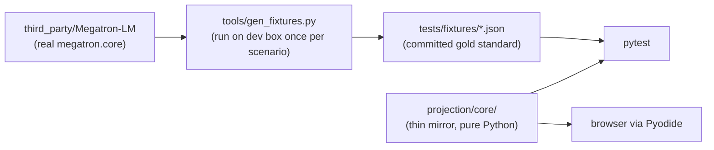

# Megatron-LM-Projection Development Plan

## Locked decisions

- **Frontend**: React + Vite + TypeScript (`web/`)
- **Python pkg mgmt**: uv (`projection/pyproject.toml`)
- **Python in browser**: Pyodide loading a built wheel of `projection/`
- **Memory math**: written from scratch in `projection/core/`, pinned against `third_party/Megatron-LM` via gold-standard JSON fixtures
- **Deployment**: GitHub Pages via GitHub Actions
- **Spec source of truth**: [../project-design.md](../project-design.md)

## Target repo layout

```
Megatron-LM-Projection/
├── projection/                       # Python core (built as a wheel)
│   ├── pyproject.toml                # uv-managed
│   ├── src/projection/
│   │   ├── configs.py                # pydantic config models
│   │   ├── model_configs/            # llama3_1_8b.yaml, deepseek_v2_lite.yaml
│   │   ├── gpu_specs/                # h100.yaml, mi300x.yaml, ...
│   │   ├── core/                     # trainer / model / block / layer / modules
│   │   ├── parallel/                 # TP/SP/PP/VPP/EP/CP/DP rules + conflict checks
│   │   └── script_gen/               # Megatron launch-script templating
│   ├── tests/
│   │   ├── unit/
│   │   └── fixtures/                 # JSON dumps from real megatron.core
│   └── tools/gen_fixtures.py         # run in env with real megatron.core
├── web/                              # React + Vite + TS
│   └── src/{pyodide,steps,components}/
├── docs/
│   ├── project-design.md
│   └── develop/                      # this plan + per-milestone detail docs
├── third_party/                      # existing submodules
└── .github/workflows/{ci.yml,deploy.yml}
```

## Milestones

### M0 — Bootstrap

Goal: every piece builds; CI deploys an empty page to GitHub Pages.

- `projection/pyproject.toml` (uv) with one trivial module + one passing pytest
- `web/` Vite+React+TS scaffold rendering "hello"
- `.github/workflows/ci.yml` runs `pytest` + `npm run build`
- `.github/workflows/deploy.yml` publishes `web/dist/` to `gh-pages`
- Write this plan to `docs/develop/develop-plan.md`

Verify: green CI; deployed URL shows "hello".

### M1 — Python core for dense model (offline)

Goal: pure-Python pipeline computes Llama3.1-8B memory breakdown matching real Megatron.

- YAML loader + pydantic config models in `projection/src/projection/configs.py`
- `core/` class hierarchy. Each class exposes `param_count()`, `activation_bytes(workload, parallel)`, `grad_bytes()`, `optimizer_state_bytes()`:
  - `Module` base + `Attention`, `MLP`, `Embedding`
  - `Layer` → `Block` → `TransformerModel` → `Optimizer` → `Trainer(rank)`
- `parallel/` rules for TP, SP, PP, CP, DP (no EP, no FSDP yet)
- Initial YAMLs: `model_configs/llama3_1_8b.yaml`, `gpu_specs/h100.yaml`
- `tools/gen_fixtures.py` dumps scenarios (e.g. 8×H100, TP=2, PP=2) using real `megatron.core` into `tests/fixtures/llama3_1_8b/`
- Gold-standard tests in `tests/unit/test_dense.py`

Verify: `pytest` green; param counts match Megatron exactly; activation/optimizer numbers within a tolerance set on first fixture landing.

### M2 — Pyodide bridge

Goal: same M1 numbers reproduced in the browser.

- `uv build` produces `projection-*.whl`; copied into `web/public/wheels/`
- `web/src/pyodide/`:
  - Load Pyodide, `micropip.install('pyyaml','pydantic', wheel_url)`
  - Typed JS facade `runProjection(input): Output`
- Minimal debug page wired to the facade
- Browser smoke test (Playwright) compares output to a fixture JSON

Verify: deployed debug page matches `pytest` numbers byte-for-byte for the same input.

### M3 — Steps 1–4 UI (dense path)

Goal: end-to-end guided flow for `llama3.1_8B`.

- **Step 1**: model dropdown → grouped YAML display → `num_layers` editable → `(proxy)` label; pie chart of per-module params; structure render (full model + single layer)
- **Step 2**: vendor + GPU model dropdown; #GPUs; primary + optional secondary spec table
- **Step 3** (three subsections):
  - Distributed strategy: BF16/FP8 + TP/SP/PP/CP/DP knobs; PP layout vs PP+VPP toggle with divisibility validator; optimizer/sharding single-select (distributed optimizer first; FSDP options deferred to M5) with conflict detection against `arguments.py`
  - Workload: `seq_length`, mbs/gbs, recompute, `sequence_parallel`
  - Hyperparameters: lr/min_lr/train_iters with defaults
- **Step 4**: total + breakdown (params/grads/activations/optimizer) with dtype labels; rank-list input (≤8) → side-by-side comparison table + bar chart

Verify: 2–3 canonical scenarios reproduce expected numbers via snapshot tests; manual click-through.

### M4 — MoE / MLA support (`deepseek_v2_lite`)

Goal: same end-to-end flow works for an MoE model.

- New modules: `MoEModule` (routed + shared experts, token dispatcher), `MLAModule` (latent KV)
- `parallel/`: add EP rules + (TP, PP, EP) combination memory math
- Workload knobs: `moe_grouped_gemm`, `moe_token_dispatcher_type`, `moe_pad_expert_input_to_capacity`
- New `model_configs/deepseek_v2_lite.yaml` + extended fixtures
- Step 1 UI visualizes MoE/MLA in the structure render

Verify: gold-standard MoE tests green; UI flow renders sensibly for `deepseek_v2_lite`.

### M5 — Step 5 + FSDP + UI polish

Goal: ship-ready.

- **Step 5**: Megatron launch-script generator using `third_party/Megatron-LM` sample scripts as templates; output in a code block with copy button
- Add Torch FSDP2 + Megatron FSDP options + their conflict detection rules
- Top-right explanation panel: every parameter gets an info icon → clicking surfaces "what it is" + "how the derived value was computed"
- Propose 2–3 visual style mockups (Tailwind themes); pick one
- A11y / responsive polish

Verify: generated script `--dry-run`-able on a real Megatron checkout for a few scenarios; manual UX walk-through.

## Memory math accuracy strategy



CI machines never need GPUs or real Megatron — they just diff `projection/core/` outputs against committed JSON fixtures. Fixtures are regenerated by us whenever the Megatron submodule bumps.

## Risks

- **Pyodide bundle size / cold start**: mitigate with a small splash + lazy load; if too slow, precompute first-paint numbers and hydrate.
- **Memory math drift vs Megatron upstream**: pin submodule; regenerate fixtures on every bump.
- **MoE/MLA complexity**: isolated to M4; M1–M3 stay simple by deferring it.
- **PP layout semantics**: validators documented in M3; revisit on Megatron upstream changes.

## Items intentionally deferred

- Activation tolerance numbers — decide in M1 when first fixtures land
- Exact UI mockups — M5
- AMD + Primus script generation — out of v1
- FP16 / MXFP4 precisions — out of v1
- Inference analysis — out of v1
- Pipeline schedules beyond 1F1B / interleaved — likely out of v1

## Per-milestone detail docs

As we start each milestone, we add a focused doc under `docs/develop/`:

- `docs/develop/M0-bootstrap.md`
- `docs/develop/M1-python-core-dense.md`
- `docs/develop/M2-pyodide-bridge.md`
- `docs/develop/M3-ui-dense-path.md`
- `docs/develop/M4-moe-mla.md`
- `docs/develop/M5-script-and-polish.md`

This top-level plan stays the index; details land just-in-time so we don't over-design.
